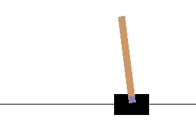
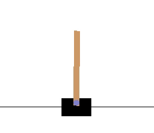

# Reinforcement Learning

Cart Pole was found to develop two strategies. The first one involves moving sharply to the opposite side, managing to mantain its position in the middle of the environment. The second one is based on subtle changes of direction, which in the long term would result in getting out of the screen. However, the limit of 500 steps per episode helps reduce the evolutive pression of the environment towards the tactic 1 given that normally the environment ends before the agents goes out of the screen (only around 10% of the times this happens before 500 steps)--------------------------------------
 
