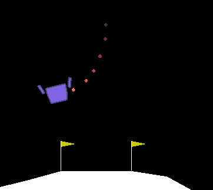
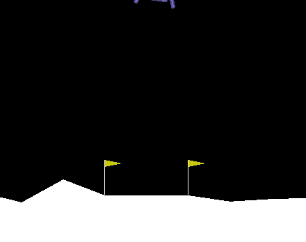
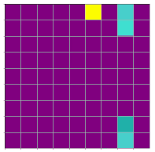
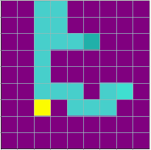
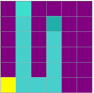
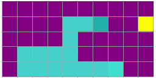

## Reinforcement Learning to-do list:

- [X] Solve CartPole with a Single Network
- [X] Solve CartPole with a Single Network using Memory Replay
- [X] Solve CartPole with a Double Network (An Online Model plus a Target Network) to stabilise the algorithm
- [X] Solve Lunar Lander (Discrete)
- [X] Learn how to implement the gradients for an Actor-Critic Model with Tensorflow
- [X] Solve Lunar Lander (Continuous) with Actor-Critic Model
- [X] Code my own environment (SNAKE) and look for proper inputs so that the AI can generalise to different boards
- [X] Solve Pendulum by Changing from Epsilon-greedy exploration strategies to noise-adding strategies
- [X] Try Bipedal Walker with DDPG (Deep Deterministic Policy Gradient). There is not enough exploration and it's difficult to escape from local optima
- [X] Implement a simple Genetic Algorithm capable of finding the minimum of a function (Beale function)
- [X] Use the Genetic Algorithm to solve the Acrobot Environment (also CartPole again)
- [X] Solve Mountain Car with a Genetic Algorithm (this environment is more challenging than it seems)
- [X] Try again Bipedal Walker with the Genetic Algorithm. Gets a better performance although it is not optimal
- [X] Try Augmented Random Search for solving Bipedal Walker. The results are worse than with genetic algorithm

- [ ] \(Optional) Solve an Atari Environment from screen pixels. It would probably take more than a week on a CPU for each hyperparameter trial...

## 1. Cart Pole
Random Agent with no training:

Links to scripts:

[Single Network](cartPole/cartPole1SingleNetwork.ipynb), [Single Network with Memory Replay](cartPole/cartPole2WithExperienceReplaySaveBestWeights.ipynb), [Double Network](cartPole/cartPole3DoubleDQN.ipynb)

The agent has two different actions: Moving left (-1) and moving right (1). Cart Pole was found to develop two strategies. The first one involves moving sharply to the opposite side, managing to mantain its position in the middle of the environment:

The second one is based on subtle changes of direction, which in the long term would result in getting out of the screen. However, the limit of 500 steps per episode helps reduce the evolutive pressure of the environment towards the tactic 1 given that normally the environment ends before the agents goes out of the screen (only around 10% of the times this happens before 500 steps):

You can test these two tactics by yourself with the following script. You need to install OpenAIGym (https://towardsdatascience.com/how-to-install-openai-gym-in-a-windows-environment-338969e24d30?gi=cdb9345d454c). The weights file (available in the cartPole/tactics folder) should be located in the same folder than the following testing script:

[Testing CartPole Weights](cartPole/cartPole0TestingCartPoleWeights.ipynb)

## 2. Lunar Lander
Agent with no training:

There are two version of this environment: Discrete and Continuous. Links to scripts:

[Discrete](lunarLander/lunarLander2Discrete.ipynb), [Continuous](lunarLander/lunarLander3Continuous.ipynb)

In the discrete one, the agent can choose between doing nothing, firing main engine, firing left engine and firing right engine. In the continuous one, the action space comprises two float values which indicate the power in the main engine (from -1 to 0 means powered off) and the relation between left and right engine power (values close to -1: left, values close to 1: right). The Actor-Critic algorithm was implemented to solve the continuous environment. The actor is a neural network that chooses for each state which output should be executed. The critic takes as input both the state and the action to be executed and grades it, judging how much reward the agent is gonna obtain in the future. Not only the critic network is trained with Q-learning, its gradient is also passed backwards to the actor so the weights are changed in the opposite direction (to maximise instead of minimising the grade to be obtained by the critic)

At first, the agent crashes quickly every time, so it needs to change its behaviour. After around 100 episodes, it learns to hover mid-air so it doesn't feel the -100 points penalisation for crashing:

It's only after hundreds of episodes of exploration that it learns that sometimes, touching the ground it's not negative, instead, it results in a +100 points reward for landing with a proper speed and angle:

As with other RL environments, these learning algorithms can be unstable when certain past-experiences dissapear from the memory array. When catastrophic learning happens in Lunar Lander, the agent stops remembering that landing with a great speed or a bad angle results in a -100 points penalisation. For this reason, it is adviced to do regular checkpoints of the agent weights to recover the best version of the agent obtained during the learning curve.

For testing the trained weights, the weights file (available in the lunarLander/tactics folder) should be located in the same folder than the following testing scripts:

[Testing Discrete](lunarLander/lunarLander0TestingDiscrete.ipynb), [Testing Continuous](lunarLander/lunarLander1TestingContinuous.ipynb)

## 3. Coding my Own Environment (SNAKE)

The Snake game was coded from scratch in order to obtain a flexible environment. In this section, different kinds of inputs and outputs for the Neural Network were tried such as passing the board of the game or the pixels obtained after rendering the board with Matplotlib. Both versions of the snake game were tested: with an Open Area in which the snake can go outside the borders and appear in the opposite side of the screen; and with a wall that kills the snake if it tries to go out. Using an Open Area made it more difficult to implement snake sensors and there were more situations in which the snake would fall into a loop in the initial training episodes:

After many trials, it was decided to use a closed area and equip the Snake with sensors which would help the AI generalise to smaller and bigger boards. Therefore, the snake can see in eight directions for which it will know the proximity of a wall, an apple or a snake body part (the proximity is given as 1/distance), making a total of 24 input numbers. Furthermore, the snake is given a one-hot vector for the direction in which it is moving plus a smelling sense to know if the apple is South, North, East or West (for all those cases in which there is not a straigth line between the snake and the apple):

Once the snake had been trained in a 9-by-9 board, it was moved to boards with different shapes in which it was tested (without further training). The AI proved to have excellent generalisation.

The snake is not perfect, however; it could be improved in the future by adding extra sensors which would let the snake know how many body parts are found in each direction (so far it can only know how close is the first one, and it often gets confused once its length is around one-third of the total squares of the board).

## 4. From Epsilon-Greedy exploration to noise-adding exploration strategies (Pendulum and Bipedal Walker)

Although Lunar-Lander continuous environment was solved using a naive Epsilon-greedy exploration strategy, this is not the preferred way for continuous action spaces. In these environments, Momentum is an important factor for the proper movement of the agent and it cannot be kept if randonmly changing actions at every time step. Two kinds of noise are commonly used: Gaussian Noise and Ornstein–Uhlenbeck noise. Both of these noise functions are stationary (its distribution doesn't change over time), Markovian (the noise only depends on the current state of the environment) and Stocastic while maintaining a Normal Distribution.

The Pendulum environment was easily solved using Gaussian Noise:

The Bipedal Walker, however; is a much more difficult environment. Not only the state contains 24 different values, but also, the action space is quite complex with 4 different actions for the force to apply at each agent torque. The greates challenge in this enviroment is to escape from local optima. The agent learns really fast to open both legs in order not to fall to the ground and lose points. If the reward function is changed in order to penalise maintaining the agent static on the floor, the agent will now learn how to fall as fast as quickly so it doesn't get penalised by applying forces before ending the episode (the reward function penalises applying forces in order to obtain an efficient robot that walks with little energy). After many trials, a different approach was tried, Genetic Algorithms.

## 5. Genetic Algorithms. From a simple function to Bipedal Walker optimization.

Genetic algorithms is an important branch of optimization algorithms which is based on how Natural Selection works in our world. Different random agents need to be evaluated with a fitness function (for example, the reward they get on a environment) in order to select the fittest ones. As with evolution, only the fittest ones will "reproduce" by obtaining other "children" agents whose parameters are intermediate between those of both "parents". These new agents will undergo some random mutations to improve the "genetic" variability of the Neural Network weights. After enough generations of agents, the Reinforcement Learning environments can be solved with quite impressive scores, however; the number of generations, and number of agents per generation quickly scales the computation cost of these algorithms.

This algorithm was able to find the minimum of the Beale function in seconds (only two parameters: X and Y). Afterwards, CartPole, was also solved in around 10 minutes. This is quite impressive when compared to the experiments with DQNs which would take hours to finish. Furthermore, when using a genetic algorithm, catastrophic forgetting is usually avoided as the Elitism Selection gets rid of those agents whose weights changes result in lower scores.

Following that, a new environment was solved: Acrobot. In this environment, the agent has to manage to get its body above the line as fast as possible:

The Mountain Car environment seems to be a rather simple environment, however; its reward function can prevent many great Reinforcement Learning algorithms from solving it. The Mountain Car reward function gives -1 each time step and 0 when the car reaches the goal. This means that the car has to randonmly go back and forth in the mountain till it gets to the top of the mountain (which is highly unlikely) just to learn that it is not always going to get a -1 reward. Other alternative reward functions such as measuring how close the car gets to the goal would fail given that the car has to learn to go left (far from the goal) in order to build momentum

Since almost no random agent can possibly obtain a great reward at the end of the episode (all of them would get -200 after 200 time steps), reward function engineering was carried out. The fitness function considers both the maximum velocity reached for each car and the closest they had been to the goal during the episode. After some generations, an optimal agent is obtained (even though it is not optimal with regard to the official fitness function, we are not considering how many step it takes to reach the goal as long as it finishes before 200 steps):

Finally, the genetic algorithm was implemented in the Bipedal Walker environment. A custom reward function was coded in order to keep along evolution those agents which reached the farthest during the assigned time. In order to make natural selection faster, the environment ended after only 500 steps considering that the fastest agent would have enough time to make its advantage worth. The results are promissing even though it is computationally expensive. Ideally, this algorithm should be run for more generations, with more agents per generation and taking into account the performance across different episodes (given that the random surface in each episode affects the velocity of the agent):

Augmented Random Search is an algorithm which explores by adding random noise to the weights of the agent (the noise we had described in a previous section was added to the actions). Applying the same perturbation in both directions (positive and negative), a derivative with high variance can be computed with respect to the parameters of the agent. This technique was tried but obtained worse results than the Genetic Algorithms (they were better than with Actor-Critic nonetheless). This is due to the surface variability in each episode, altogether with the need of obtaining a good first random agent to train (if it gets static on the floor, a small perturbation in the weights is not likely going to change its behaviour) and a reward function that doesn't encourage the agent to explore (penalising the forces applied). Using a custom reward function didn't help either, since the agent would slowly learn to jump and fall as far as possible as a consequence of these small derivatives.
