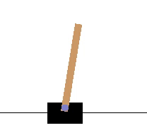
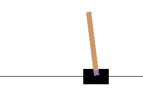

## Reinforcement Learning to-do list:

- [X] Solve CartPole with a Single Network
- [X] Solve CartPole with a Single Network using Memory Replay
- [X] Solve CartPole with a Double Network (An Online Model plus a Target Network) to stabilise the algorithm
- [X] Solve Lunar Lander (Discrete)
- [ ] Learn how to implement the gradients for an Actor-Critic Model with Tensorflow
- [ ] Solve Lunar Lander (Continuous) with Actor-Critic Model
- [ ] Solve Bipedal Walker
- [ ] Solved Bipedal Walker Hardcore
- [ ] \(Optional) Solve Atari Breakout. It would probably take more than a week computing each training loop...

## 1. Cart Pole
Random Agent with no training:

Links to scripts:

[Single Network](cartPole/cartPole1SingleNetwork.ipynb), [Single Network with Memory Replay](cartPole/cartPole2WithExperienceReplaySaveBestWeights.ipynb), [Double Network](cartPole/cartPole3DoubleDQN.ipynb)

Cart Pole was found to develop two strategies. The first one involves moving sharply to the opposite side, managing to mantain its position in the middle of the environment:

The second one is based on subtle changes of direction, which in the long term would result in getting out of the screen. However, the limit of 500 steps per episode helps reduce the evolutive pression of the environment towards the tactic 1 given that normally the environment ends before the agents goes out of the screen (only around 10% of the times this happens before 500 steps):

You can test the two tactics by yourself with the following script. You need to have installed OpenAIGym (https://towardsdatascience.com/how-to-install-openai-gym-in-a-windows-environment-338969e24d30?gi=cdb9345d454c) and the weights (available in the cartPole folder) should be located in the same folder than the script:

[Testing CartPole Weights](cartPole/cartPole0TestingCartPoleWeights.ipynb)

## 2. Lunar Lander
(WORKING ON IT)....
